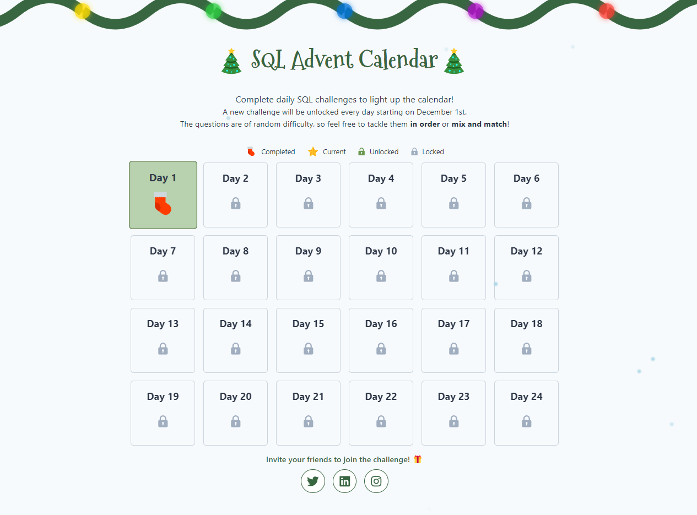

# SQL Advent Calendar Challenge

Participating in the SQL Advent Calendar Challenge, a 24-day SQL practice event created by [Dawn Choo](https://www.linkedin.com/in/data-dawn/) (ex-Meta, ex-Amazon). The challenge runs throughout December 2024, featuring daily SQL questions at various difficulty levels.

Challenge Link: [SQL Advent Calendar Challenge](https://www.sqlcalendar.com/app/advent-calendar)

 

## Daily Solutions

Day | Date       | Difficulty | Status
----|------------|------------|-------
1   | 2024-12-01 | Medium     | Done ✅
2   | 2024-12-02 |            |
3   | 2024-12-03 |            |
4   | 2024-12-04 |            |
5   | 2024-12-05 |            |
6   | 2024-12-06 |            |
7   | 2024-12-07 |            |
8   | 2024-12-08 |            |
9   | 2024-12-09 |            |
10  | 2024-12-10 |            |
11  | 2024-12-11 |            |
12  | 2024-12-12 |            |
13  | 2024-12-13 |            |
14  | 2024-12-14 |            |
15  | 2024-12-15 |            |
16  | 2024-12-16 |            |
17  | 2024-12-17 |            |
18  | 2024-12-18 |            |
19  | 2024-12-19 |            |
20  | 2024-12-20 |            |
21  | 2024-12-21 |            |
22  | 2024-12-22 |            |
23  | 2024-12-23 |            |
24  | 2024-12-24 |            |